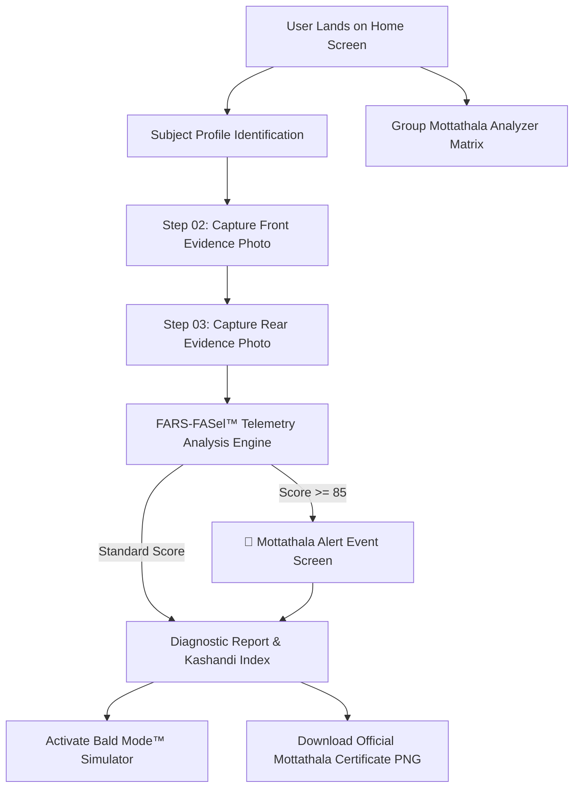

# KASHANDI FINDER™ 🎯
### THE WORLD'S MOST UNNECESSARILY ADVANCED CRANIAL VEGETATION ANALYSIS SYSTEM™

> **"Are you Mottathala? Let's find out."**
> 
> *A ThinkerHub Useless Project* — "Department of Cranial Vegetation Analysis"

---

## Basic Details

### Team Name: Cranial Research Taskforce

### Team Members
- Team Lead: Beon Binesh

### Project Description
A hilarious, production-quality React web application built with Vite, TypeScript, Tailwind CSS, Framer Motion, and Web Audio API. It performs an absurdly over-engineered cranial vegetation & forehead ratio analysis using front and rear evidence photographs. Features FARS-FASel™ Engine v3.0, Mottathala Alert event screen, Bald Mode simulator, Official Mottathala Certificate PNG generator, and Group Mottathala Analyzer!

### The Problem (that doesn't exist)
For centuries, humanity has sent rovers to Mars and mapped the human genome. Yet, when faced with a receding hairline, medical science whispered *"it's genetic"* and handed out baseball caps.

### The Solution (that nobody asked for)
We built the **KASHANDI RESEARCH AUTHORITY™** to measure your forehead in high definition using browser-native HTML5 Canvas pixel analysis, Web Audio alarms, and satirical classification algorithms (`HAIR FORTRESS`, `PRE-KASHANDI`, `EMERGENCY KASHANDI`, `MOTTATHALA FOUND`).

---

## Technical Details

### Technologies/Components Used

**For Software:**
- **Languages:** TypeScript, HTML5, CSS3
- **Frameworks:** React 19, Vite 6
- **Styling:** Tailwind CSS (Glassmorphism & Dark Mode)
- **Animations:** Framer Motion
- **Icons:** Lucide React
- **Audio Synthesizer:** Native Web Audio API
- **Computer Vision:** Client-side HTML5 Canvas pixel sampling & forehead ratio algorithm

---

## Implementation

### Software Setup & Run

```bash
# Clone the repository
git clone https://github.com/your-username/kashandi-finder.git

# Navigate to project directory
cd useless_project_temp-main

# Install dependencies
npm install

# Start local development server
npm run dev

# Build for production
npm run build
```

---

## Project Documentation


### Workflow Diagram



---


---

Made with ❤️ at TinkerHub Useless Projects 


